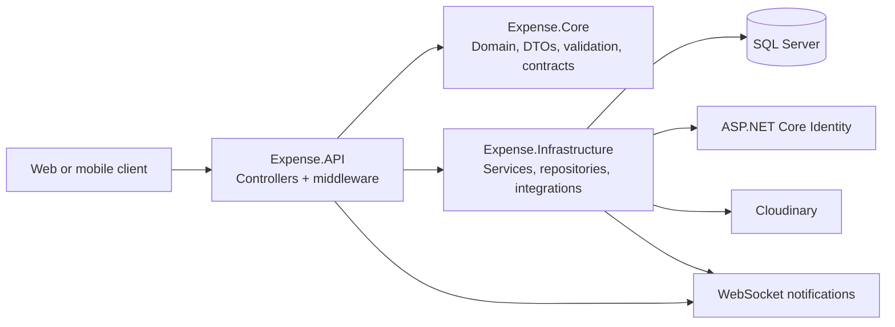

# ExpenseSolution

> A production-oriented ASP.NET Core API for tracking shared expenses, understanding who owes whom, and settling group debts with an auditable record.

ExpenseSolution helps roommates, travel groups, and teams manage shared spending without manual calculation. It records who paid, how an expense is divided, resulting balances, and settlements, while also supporting private personal expenses, category-based insights, and real-time notifications.

## Highlights

- Accurate equal and custom expense splits
- Derived balances, settlement validation, and per-currency debt simplification
- JWT and Google/Facebook social authentication with role and membership controls
- Personal expenses, unified activity feed, category insights, and native WebSocket notifications
- Unit and integration tests, Docker Compose, and GitHub Actions

## Technology stack

| Area | Technology |
| --- | --- |
| Runtime | .NET 10, ASP.NET Core Web API, C# |
| Data | EF Core, SQL Server, ASP.NET Core Identity |
| API | REST controllers, Swagger / OpenAPI, FluentValidation |
| Security | JWT bearer authentication, role and membership authorization, Google/Facebook social login |
| Real time | Native ASP.NET Core WebSockets |
| Operations | Serilog, Cloudinary, Docker / Docker Compose, GitHub Actions |
| Quality | xUnit, FluentAssertions, Moq, `WebApplicationFactory` |

## Architecture

The solution uses a layered architecture with explicit dependency boundaries; it is **not** full Vertical Slice Architecture or CQRS. Controllers in `Expense.API` delegate to feature-focused interfaces and services. `Expense.Core` contains domain entities, DTOs, service/repository contracts, validation, and shared exceptions. `Expense.Infrastructure` implements persistence, Identity, external integrations, and application services with EF Core, repositories, and a unit of work.



```text
Expense.API/                HTTP API, middleware, startup configuration
Expense.Core/               Domain model, DTOs, contracts, validation, exceptions
Expense.Infrastructure/     EF Core, repositories, services, Identity, integrations
Expense.UnitTests/          Focused unit tests for services and validation
Expense.IntegrationTests/   End-to-end API and persistence-flow tests
```

## Core capabilities and business rules

### Shared expenses and splits

An expense belongs to a group and records its payer, amount, currency, date, optional category, and member shares. When no splits are provided, the amount is divided equally among group members; any rounding remainder is assigned deterministically to the payer. Custom splits must reference group members and total the expense amount exactly.

### Balances and settlements

Balances are calculated rather than stored as a mutable ledger total:

`balance = amount paid − amount shared + settlements sent − settlements received`

A positive balance means the member is owed money; a negative balance means the member owes money. Settlement creation requires both parties to be group members, prevents self-payment, and rejects amounts exceeding the payer’s debt or payee’s credit. Settlement activity is recorded with the operation.

### Debt simplification and currencies

The API produces settlement suggestions using greedy debtor/creditor matching. Suggestions are calculated independently for each currency, preserve every member’s net position, and do not create settlement records. Expenses and settlements carry their currency and an optional stored exchange rate; group-balance calculations use that rate when present. The API does not fetch rates or perform currency conversion.

### Personal expenses, insights, and audit trail

Private personal expenses are separate from group expenses and support categories. The home feed combines group expenses, settlements, and personal expenses. Insights aggregate category totals by currency, across month, year, or all-time periods, for either group-wide or current-user scopes. Activity logs provide a group-level record of key actions.

### Real-time notifications

The API persists notifications and broadcasts real-time events to connected recipients through `GET /ws/notifications` WebSockets. The WebSocket uses the same JWT bearer flow; clients may supply the token through the `access_token` query parameter.

## API documentation

- Run the API and open `/swagger` for interactive OpenAPI documentation.
- [API_COLLECTION.md](API_COLLECTION.md) documents endpoints, request examples, headers, and the common response envelope.
- [MOBILE_API_GUIDE.md](MOBILE_API_GUIDE.md) provides client integration guidance.
- [ExpenseSolution.postman_collection.json](ExpenseSolution.postman_collection.json) can be imported into Postman.

Protected endpoints require `Authorization: Bearer <access-token>`. Localized messages support `Accept-Language: en` and `ar`.

## Getting started

### Prerequisites

- .NET SDK 10
- SQL Server or LocalDB
- Docker Desktop (optional)
- Cloudinary credentials for file-upload functionality

### Run locally

1. Configure the required settings with user secrets or environment variables. Never commit them.
2. Create or update the local database from the included EF Core migrations:

   ```bash
   dotnet ef database update --project Expense.Infrastructure --startup-project Expense.API
   ```

3. Restore, test, and run:

   ```bash
   dotnet restore ExpenseSolution.slnx
   dotnet test ExpenseSolution.slnx
   dotnet run --project Expense.API
   ```

4. Browse to the HTTPS URL printed by ASP.NET Core and open `/swagger`.

The development configuration uses LocalDB by default. Required JWT and Cloudinary settings are intentionally blank and must be supplied by the operator.

### Configuration

Use standard ASP.NET Core environment-variable binding (double underscores represent nesting). Store local values in user secrets, your shell, or an untracked `.env` file for Docker Compose.

| Variable | Required | Purpose |
| --- | --- | --- |
| `ConnectionStrings__DefaultConnection` | Outside `Test` | SQL Server connection string |
| `JwtSettings__Key` | Yes | JWT signing key |
| `JwtSettings__Issuer` | Yes | Token issuer |
| `JwtSettings__Audience` | Yes | Token audience |
| `Cloudinary__CloudName` | Yes | Cloudinary cloud name |
| `Cloudinary__ApiKey` | Yes | Cloudinary API key |
| `Cloudinary__ApiSecret` | Yes | Cloudinary API secret |
| `AllowedOrigins__0` (and subsequent indices) | Deployment-specific | Explicit CORS origins |
| `MSSQL_SA_PASSWORD` | Docker Compose database | SQL Server container administrator password |

See [SECURITY_CONFIGURATION.md](SECURITY_CONFIGURATION.md) for operational guidance and a non-secret local `.env` template.

## Docker

The root [Dockerfile](Dockerfile) builds the API with a multi-stage .NET 10 image. `docker-compose.yml` starts the API and SQL Server, publishes API ports `5000` and `5001`, and persists SQL Server data in the `db-data` volume.

Create an untracked `.env` file with the variables above, then run:

```bash
docker compose up --build
```

Provision the database with EF Core migrations as part of deployment; the application does not automatically run migrations at startup.

## Testing

Unit tests cover services, validation, authorization checks, currency handling, and debt simplification. Integration tests exercise group, expense, balance, settlement, insight, notification, WebSocket, and security flows.

```bash
dotnet test ExpenseSolution.slnx --configuration Release
```

## CI/CD

GitHub Actions contains two independent workflows:

- **Continuous Integration** restores, builds, and runs the solution test suite on pushes and pull requests.
- **MonsterASP deployment** builds and publishes `Expense.API` on pushes to `main` or `master`, then deploys through Web Deploy. Deployment settings are supplied only through GitHub repository secrets.

## Security and operations

- Startup validates required JWT, Cloudinary, and non-test database configuration.
- JWT validation checks issuer, audience, lifetime, signing key, active user state, and token version.
- CORS uses explicitly configured origins with credentials; never use wildcard origins with credentials.
- Identity uses password rules, unique emails, and lockout after repeated failures.
- Central exception handling, structured Serilog request logging, and trace IDs support diagnosis.
- `.gitignore` excludes environment files, build artifacts, logs, and common credential-bearing files.

## Additional documentation

- [BUSINESS_OVERVIEW.md](BUSINESS_OVERVIEW.md) — product context and business constraints
- [SRS.md](SRS.md) — requirements reference
- [LOGGING_SAFETY_AUDIT.md](LOGGING_SAFETY_AUDIT.md) — logging and sensitive-data review

## Portfolio notes

This project focuses on the expense-sharing concerns that are easy to get subtly wrong: split validation, net balances, over-settlement protection, currency-aware debt suggestions, access control, and operational configuration. It deliberately uses pragmatic layered services, repositories, and a unit of work rather than claiming patterns not represented by the codebase.
